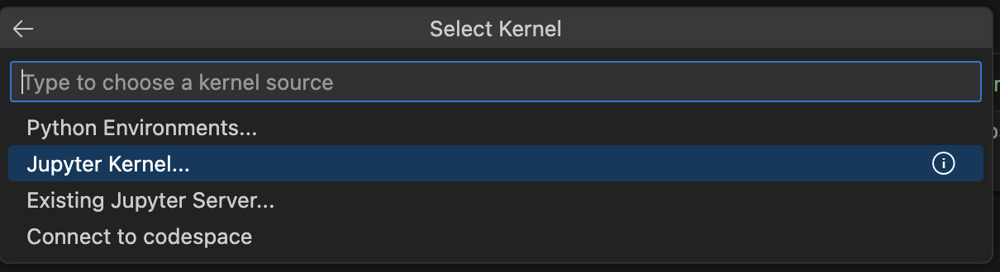
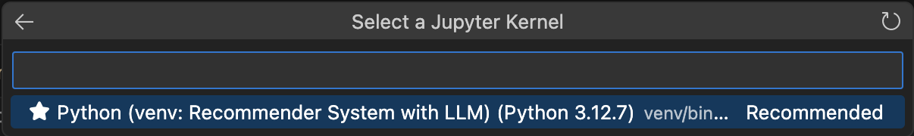

TSUM Recommender System
==============================

A recommender system for TSUM e-commerce platform to improve product recommendations.

Project Organization
------------

    ├── Makefile                   <- Makefile with commands like `make create_environment`, `make requirements` or `make add_kernel`
    ├── README.md                  <- The top-level README for developers using this project.
    ├── data        
    │   ├── interim                <- Intermediate data that has been transformed.
    │   ├── processed              <- The final, canonical datasets for modeling.
    │   └── raw                    <- The original, immutable data dump.
    │        
    ├── models                     <- Trained and serialized models
    │
    ├── notebooks                  <- Jupyter notebooks (research).
    │
    ├── requirements-windows.txt   <- The requirements file for unix systems.
    │
    ├── requirements-windows.txt   <- The requirements file for Windows.
    │
    ├── src                        <- Source code for use in this project (scripts to download or generate data).
    │
    └── junk                       <- Other files

--------

# Quick Start: Local `venv` Environment

1. **Clone the repository:**

    ```bash
    git clone https://github.com/dimi3tru-other-projects/Recommender_System_with_LLM.git
    cd Recommender_System_with_LLM
    ```

2. **Create a Python virtual environment inside the project folder:**

    ```bash
    make create_environment
    ```

    This command:
    - Creates a local `venv` directory
    - Installs/upgrades `pip`, `setuptools`, and `wheel` inside it

3. **Activate the environment:**

    **_Unix_**:
    ```bash
    source venv/bin/activate
    ```

    **_Windows_**:
    ```powershell
    venv\Scripts\Activate.ps1
    ```
    or
    ```cmd
    venv\Scripts\activate.bat
    ```

    > **Important**: You should keep this environment active in your terminal session whenever you want to install packages or run project code.

4. **Install dependencies:**

    ```bash
    make requirements
    ```

    By default, this will:
    - Run `test_environment` (which calls `python3 test_environment.py`)
    - Install packages from `requirements.txt`

    Ensure you have the environment activated so that packages are installed into `venv` rather than your system Python.

5. **(Optional) Register or remove the Jupyter kernel:**

    If you plan to use Jupyter notebooks in this project, you can register the current virtual environment as a Jupyter kernel:

    ```bash
    make add_kernel
    ```

    This will:

    * Create a named Jupyter kernel based on your `PROJECT_NAME`
    * Make it available in the Jupyter interface as `"Python (venv: Recommender System with LLM)"`

    **Note:** You should reload your IDE after this command, then you will recieve one more field.
    
    

    Later, if you want to remove the kernel:

    ```bash
    make remove_kernel
    ```

    This deletes the kernel entry from your local Jupyter configuration, but does not affect the `venv` itself.

    > **Note:** Kernel specs are stored in:
    >
    > * **macOS / Linux**: `~/.local/share/jupyter/kernels/`
    > * **Windows**: `%APPDATA%\jupyter\kernels\`
    >
    > The kernel simply points to your virtual environment’s Python interpreter. If you delete or move the environment, the kernel will stop working until re-registered.

    _To view your current Jupyter kernels_:
    ```bash
    jupyter kernelspec list
    ```
